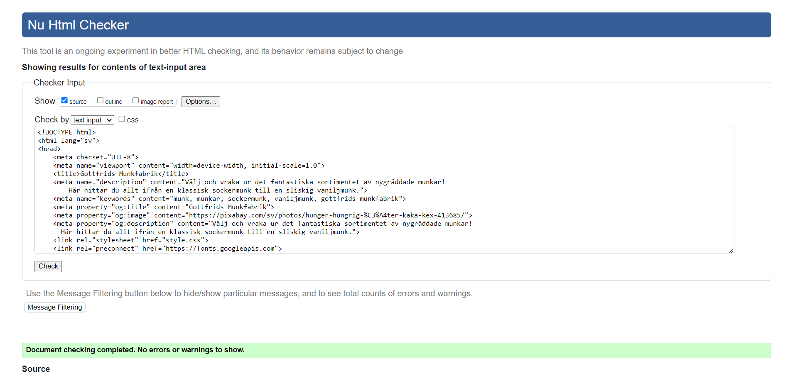
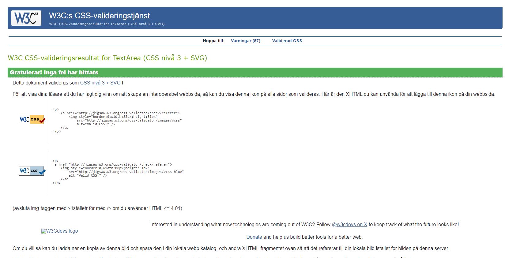
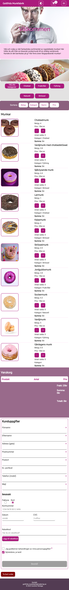
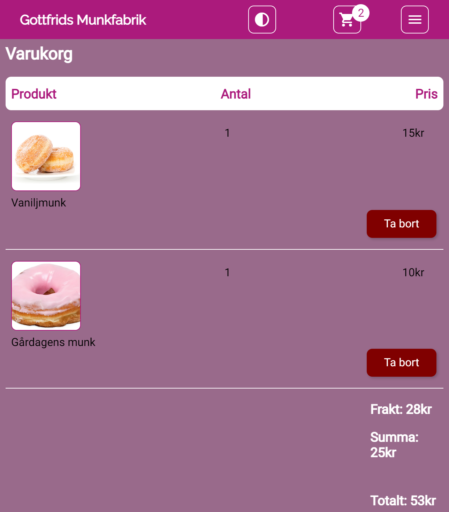

# ASSIGNMENT - WEB SHOP 
_Course: JavaScript - Fundamental course_
> Visit my project: https://medieinstitutet.github.io/fed23d-js-grundkurs-webshop-CarolineVarsaga/

## SCREENSHOTS
### Lighthouse
_Checking performance, accessibility, best practice and SEO_

### HTML validation
_(Whole page screenshot in the project files)_
 _"No errors or warnings to show."_

### CSS validation
_(Whole page screenshot in the project files)_
 _"Congratulations! No errors found."_

### Whole page
_Desktop_
 _(I have centered the headings in the cart-section header)_

_Mobile_

>_Tablet mode is similar to the mobile view, but the form is positioned as it is in desktop mode._

### Products in cart

## WHAT I USED
Built with: 
- Semantic HTML5 markup
- CSS/SASS
- Flexbox
- Grid
- JavaScript
- RegEx

## ABOUT THIS PROJECT 
In this assignment, my task was to build a web shop in 4 weeks. The focus was on JavaScript, so please ignore the incomplete styling. The following requirements were to be included:  

### _General_
- Order page should be ONE page; you should not switch between shopping cart and product overview, etc. So, ONE HTML file and corresponding JavaScript code are sufficient.
- The webshop should be responsive. The design/appearance is up to you, but it should work on mobile, tablet & desktop.
- The interface/page appearance should be intuitive.
- The entire ordering process should be doable using only the keyboard (accessible).
- Next to/in connection with each donut, there should be buttons to increase and decrease the quantity of ordered donuts. Ensure that these buttons work seamlessly with the keyboard.
- Donuts are hardcoded in the file (they do not need to come from an API, a database, or a JSON file).
- After clicking the order button, a confirmation box should appear with information about the order and delivery time.
- Products should be sortable based on name, price, category, and rating.

### _Order summary_
- The total amount should be updated based on changes in the quantity of ordered donuts in real-time.
- There should be a cart summary displaying only the donuts that have been ordered. This should be separate from the actual order form.

### _the Products_
Each donut should have the following properties:

- A name
- A price
- A rating
- A category
- There should be at least 10 donuts in the webshop.

### _Special rules_
- On Mondays before 10 AM, a 10% discount is applied to the entire order amount. This is displayed in the order summary as a line with the text "Monday Discount: 10% on the entire order."
- On Fridays after 3 PM until the night between Sunday and Monday at 3 AM, a weekend surcharge of 15% is added to all donuts. This information should not be apparent to the customer; the price should only be higher in the "output" of the donuts.
- If the customer has ordered a total of more than 800 kr, invoice payment is not available as a payment option.
- If the customer has ordered at least 10 donuts of the same type, the price for that specific type of donut should be discounted by 10%.
- If the customer orders a total of more than 15 donuts, the shipping is free. Otherwise, the shipping cost is 25 kr plus 10% of the total amount in the shopping cart.
- If the customer has not placed the order within 15 minutes, the order form should be cleared, and the customer should be notified that they were too slow.

### _Form - customer information_
The form where the buyer fills in their information should have:

- Fields for:

    - First Name
    - Last Name
    - Address (street)
    - Zip Code
    - City
    - Optional: Door Code
    - Phone (mobile)
    - Email Address
    - Payment method selection: card or invoice
        - If invoice is chosen, a form field for a Swedish personal identification number (personnummer) should be displayed. This field should also be validated before the form can be submitted, meaning that a correct personal identification number must be entered.
        - If card is chosen as the payment method, fields for card number, expiration date/year, and CVC should be displayed. These do not need to be validated.
    - Checkbox for approval of the processing of personal data
    - Checkbox for subscribing to the newsletter (should be checked by default)

- All form fields should be validated, and the form/order should not be allowed to be submitted if there are any errors. Errors should be clearly marked and communicated (e.g., not solely with red color, taking accessibility into account).

- When the form is correctly filled out, the "Submit/Order" button should be activated; otherwise, it should be grayed out.

- There should be a "Clear Order" button that resets all form fields as well as any ordered donuts/products (meaning the quantity is reset to 0).

- There should be a field to enter a discount code.

### _Additional Information_
- There should be some form of visual feedback when the total amount in the shopping cart is updated. By this, it means, for example, a visual change such as a color shift, size change, or equivalent.

### Learning objectives & assessment 
- Logic & flow of program
- Comments and self-documenting code
- High code quality, conventions
- Conditionals (if statements)
- Events
- DOM manipulation
- Functions
- Variables
- Arithmetic
- Objects
- Arrays
- Timers
- Loops
- Date

## ABOUT THE PROCESS AND THOUGHTS
At the beginning, this felt like a huge task! But after taking one thing at a time and creating checklists, it has flowed smoothly. I have stayed within the timeframes. From having no knowledge in JavaScript to creating a webshop in 4 weeks - I am incredibly satisfied with what I have accomplished!

>Here is a list of some additional features that I have implemented on the website:

- Locked scrolling when the order confirmation window appears.
- The timer that clears the shopping cart and form starts when adding a product to the cart and stops when clearing it. The timer also stops when starting to fill in the form.
- Added the option to choose a dark theme on the page.
- A number is displayed on the shopping cart icon, updating as products are added to the cart.
- Implemented both category and sorting buttons. Ensured that the sorting function works even when a category is selected (otherwise, it automatically sorts all products).
- Shipping costs are added to the total when adding a product.
- Also added these special rules:
    - Generally, orders are delivered 30 minutes from when the order is placed, with the following exceptions:
        - On weekends, the delivery time is 1.5 hours.
        - In the middle of the night, delivery is in 45 minutes.
        - If the order is placed on a Friday between 11 am and 1 pm (when the staff has a weekly meeting), the delivery time is at 3 pm.
- When pressing on "Gottfrids Munkfabrik", it takes you to the top of the page.
- Added 90% brightness to images in dark theme.
- I realized that using a (anchor) tags either inside or outside a button was not accessible. So, I implemented a JavaScript function that navigates to the shopping cart when the button is clicked.
> I also found out that if you lay an order let's say 11:31pm, and the order will take 30 minutes so it passes midnight, the date wouldn't change. So I solved this one.

## AUTHOR
_Caroline Vårsaga -2023_
 _Studying "Front End Developer" at Medieinstituet_
- GitHub: https://github.com/CarolineVarsaga
- LinkedIn: https://www.linkedin.com/in/caroline-varsaga